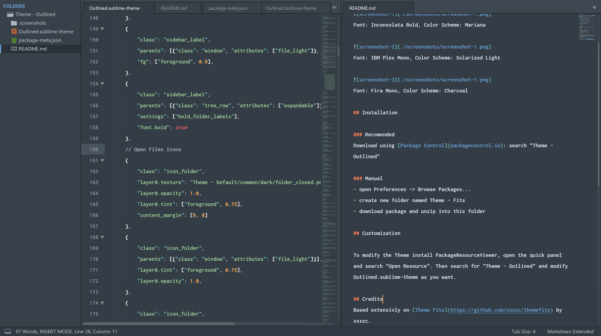
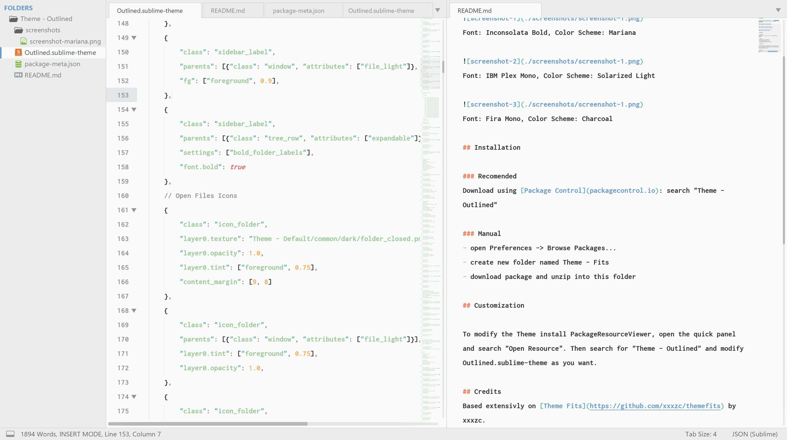
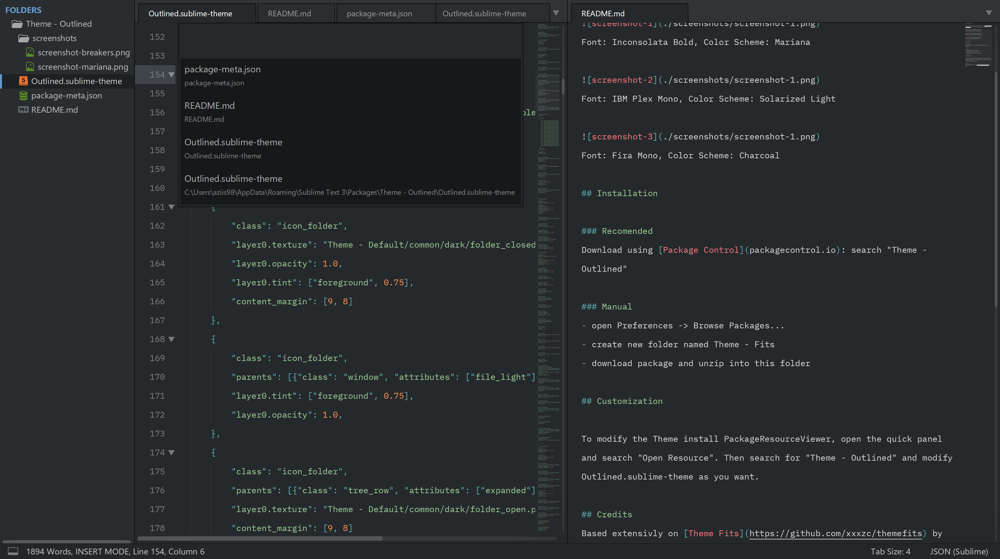

# Theme Outlined

An adaptive Sublime Text 3 Theme based on [Theme Fits](https://github.com/xxxzc/themefits) that can be used to almost all color schemes.  

 
Font: Inconsolata Bold, Color Scheme: Mariana

 
Font: Inconsolata Bold, Color Scheme: Breakers

 
Font: IBM Plex Mono, Color Scheme: Charcoal

## Installation

### Recomended
Download using [Package Control](https://packagecontrol.io): search "Theme - Outlined"

### Manual
- Open Preferences -> Browse Packages...
- Create new folder named "Theme - Outlined"
- Download the package and unzip it into this folder

## Customization

To modify the theme install "PackageResourceViewer", open the Quick Panel and search "Open Resource". 
Then search for "Theme - Outlined" and modify `Outlined.sublime-theme` as you want.

## Credits
Based extensivly on [Theme Fits](https://github.com/xxxzc/themefits) by xxxzc.